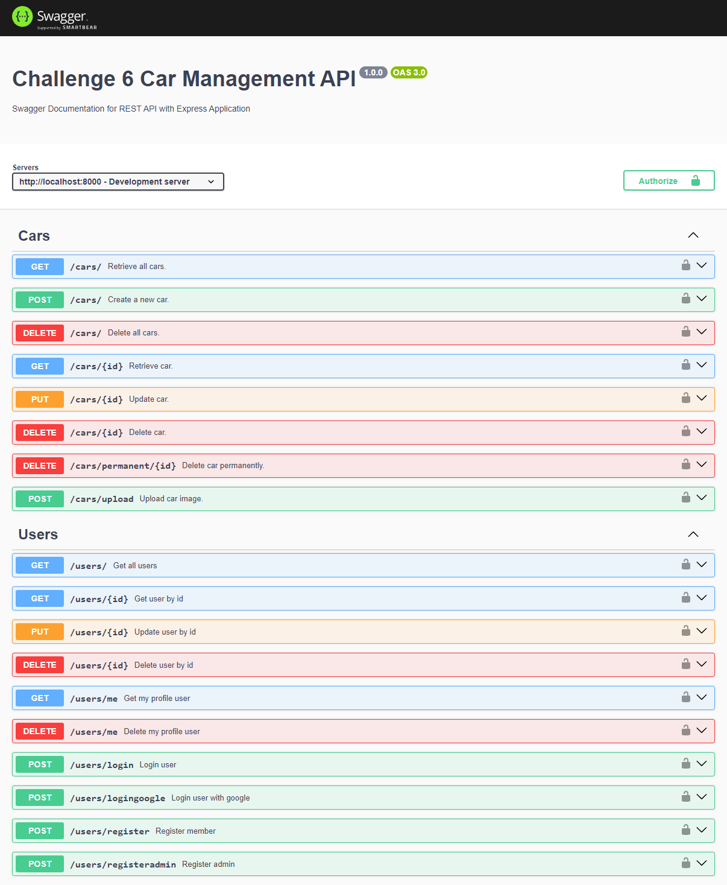

# Car Management API

Repository ini digunakan untuk menyelesaikan Challenge 6 pada kelas Full-Stack Web Dev SYNRGY Academy

Dokumentasi API menggunakan Swagger di : http://localhost:8000/docs

# Cara Menjalankan Project

- Clone repository ini ke directory yang telah ditentukan
- Jalankan perintah `npm install` untuk menginstall semua dependencies yang dibutuhkan
- Sesuaikan pengaturan `development` pada file `config/config.js` sesuai database PostgreSQL yang digunakan
- Jalankan perintah `sequelize db:create` untuk membuat database
- Jalankan perintah `npm run dev` untuk menjalankan aplikasi bersamaan dengan seeding data pada database

# Role User

- Member

  - email : member@gmail.com
  - password : 12345678

- Admin

  - email : admin@gmail.com
  - password : 12345678

- Superadmin
  - email : superadmin@gmail.com
  - password : 12345678
